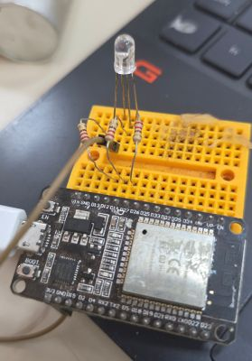

# PWM
<P>PWM - Simulando saída analógica

PWM (Pulse Width Modulation) é uma técnica de modulação utilizada para controlar a potência fornecida a dispositivos eletrônicos, variando a largura de pulso de um sinal digital de acordo com uma frequência fixa. No ESP32, o PWM é implementado de maneira eficiente utilizando o hardware interno do microcontrolador.

Sugestões de Aplicação para PWM no ESP32

## Controle de Motores:

Motores DC: Controlar a velocidade de rotação de motores DC.

Servomotores: Ajustar a posição dos servos.

##  Controle de Iluminação:

LEDs: Variar a intensidade luminosa de LEDs e fitas de LED.

Lâmpadas: Controlar a luminosidade de lâmpadas incandescentes ou halógenas.

##  Geradores de Sinais:

Audio: Gerar sons ou música simples.

Comunicação: Transmissão de sinais modulados.

##  Conversores de Potência:

Fontes de Alimentação: Controle de conversores DC-DC.

## Exemplo de um sinal PWM


## Pinos disponíveis com saída PWM


## Exemplos:

01: <a href=https://wokwi.com/projects/341562296506516051>LED RGB e uso de analog_write() para PWM</a>

### Exemplo de Código Usando analogWrite() para Controlar o Brilho de um LED

```ruby
// fonte: https://www.arduino.cc/en/Tutorial/BuiltInExamples/Fade
int led = 12;           // pino PWM ao qual o LED está conectado
int brightness = 0;    // nível de brilho do LED
int fadeAmount = 5;    // quantidade de variação do brilho a cada ciclo

// a rotina setup() executa uma vez ao pressionar reset:
void setup() {
  // define o pino 12 como saída:
  pinMode(led, OUTPUT);
}

// a rotina loop() executa continuamente em repetição:
void loop() {

  // ajusta o brilho do LED no pino especificado:
  analogWrite(led, brightness);

  // altera o brilho para a próxima passagem pelo loop:
  brightness = brightness + fadeAmount;

  // inverte a direção da variação do brilho
  // quando atingir os limites mínimo ou máximo:
  if (brightness <= 0 || brightness >= 255) {
    fadeAmount = -fadeAmount;
  }

  // aguarda 30 milissegundos para visualizar o efeito de transição:
  delay(30);
}
```

### Exemplo com 3 leds RGB




https://wokwi.com/projects/465049101568074753 

<P><a href=http://www.cdme.im-uff.mat.br/matrix/matrix-html/matrix_color_cube/matrix_color_cube_br.html>Tabela de cores RGB</a>
<P> 	


# Duty Cycle em PWM

O **Duty Cycle**, também chamado de **ciclo de trabalho**, representa a porcentagem do tempo em que um sinal PWM permanece em nível alto (*ligado*) durante um período completo do sinal.

Em um sinal PWM (*Pulse Width Modulation*), o período é composto por dois tempos:

- **TON**: tempo em que o sinal permanece em nível alto;
- **TOFF**: tempo em que o sinal permanece em nível baixo.

O valor do Duty Cycle é calculado pela relação entre o tempo ligado e o período total do sinal.

Ao variar o Duty Cycle, é possível controlar a potência média aplicada à carga sem alterar a tensão de alimentação.


## Arduino - Função AnalogWrite() (Abstração)

No ESP32, a função analogWrite() tradicionalmente usada em outras placas Arduino não é diretamente suportada pela biblioteca padrão. No entanto, podemos criar uma função similar utilizando as funções de controle PWM do ESP32 (ledcSetup(), ledcAttachPin(), ledcWrite()).

Aqui está como você pode criar uma função analogWrite() personalizada para o ESP32:

```ruby
// Mapeia os pinos PWM para os canais PWM do ESP32
int pwmChannel = 0;
int freq = 5000; // Frequência em Hz
int resolution = 8; // Resolução de 8 bits

void analogWrite(int pin, int value) {
  ledcAttachPin(pin, pwmChannel);
  ledcSetup(pwmChannel, freq, resolution);
  ledcWrite(pwmChannel, value);
}
```

### Canal PWM: 

Se precisar usar mais de um pino PWM, você deve gerenciar diferentes canais PWM.

### Frequência e Resolução:

A frequência e a resolução podem ser ajustadas conforme a aplicação. A frequência de 5000 Hz e a resolução de 8 bits são comuns para muitas aplicações de LED.

# TAREFA SUAP 


